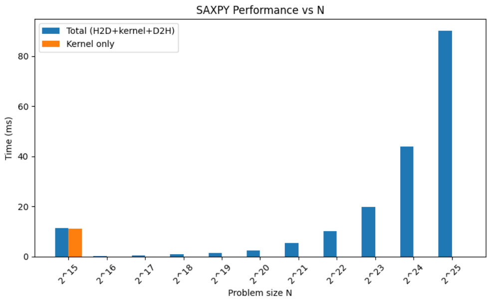

# Challenge #13: Benchmarking Different SAXPY Problem Sizes

## Problem Statement

In this challenge, you will:

- Set up a CUDA development environment.
- Modify existing SAXPY CUDA code to measure performance for increasing problem sizes.
- Profile both total execution time (including memory allocations and transfers) and kernel-only execution time using `cudaEvent` timers.
- Visualize the results in a bar plot to analyze scaling behavior and overheads.

**Target problem sizes:** N = 2¹⁵, 2¹⁶, …, 2²⁵ (you may limit to a subset or single size for focused benchmarks).

## What We Did

1. **Prepared the CUDA Source File**  
   - Created `saxpy_bench.cu` from NVIDIA’s `saxpy.cu` example.  
   - Defined the `__global__ saxpy` kernel for `y[i] = a * x[i] + y[i]`.

2. **Added Timing Logic**  
   - Employed `cudaEvent_t` timers for two intervals: total end-to-end (H2D copy, kernel, D2H copy) and kernel-only execution.

3. **Looped Over Problem Sizes**  
   - Implemented `for (exp = 15; exp <= 25; ++exp)` to benchmark N = 1<<exp for each power of two.

4. **Data Collection and CSV Output**  
   - Printed CSV lines: `exp,N,total_ms,kernel_ms`, then redirected to `saxpy_timings.csv` for analysis.

5. **Visualization in Python**  
   - Loaded the CSV in a Colab Python cell via NumPy.  
   - Plotted side-by-side bars for total vs. kernel-only times using Matplotlib.

6. **Analysis and Summary**  
   - Verified that the first iteration includes driver start-up overhead.  
   - Observed kernel timings below timer resolution for small N.  
   - Confirmed linear growth of total time with N and identified memory-bound behavior.

## How to Reproduce

Please open and run the Colab notebook at: [Your CUDA SAXPY Benchmark Colab](https://colab.research.google.com/drive/1Kpr5OXIo7wGUZkylt19HKSLoNQNCXFz9?usp=sharing)

## Performance Plot



*Figure: Execution times for total end‑to‑end (blue) and kernel‑only (orange) across N = 2^15…2^25.*

## Summary Points

- **First‑launch overhead:** The initial kernel invocation (N=2¹⁵) includes one‑time GPU driver/context startup, inflating its “kernel_ms” reading.
- **Timer granularity limit:** Subsequent per‑launch kernel times (~0.002–0.003 ms) fall near or below the CUDA event timer’s resolution, appearing constant.
- **Linear end‑to‑end scaling:** Total execution time (H2D copy + kernel + D2H copy) grows roughly linearly with N, characteristic of memory‑bound operations.
- **Overhead-dominant for small N:** For smaller problem sizes, data transfer and launch overheads dominate the overall runtime; compute is negligible.
- **Compute contribution for large N:** At larger N values, the kernel compute time becomes a more significant fraction of total time, though transfers still contribute notably.

### Image Format

Place your performance plot image in the repository (PNG or JPEG recommended) and reference it using standard Markdown syntax, for example:

```markdown

```

