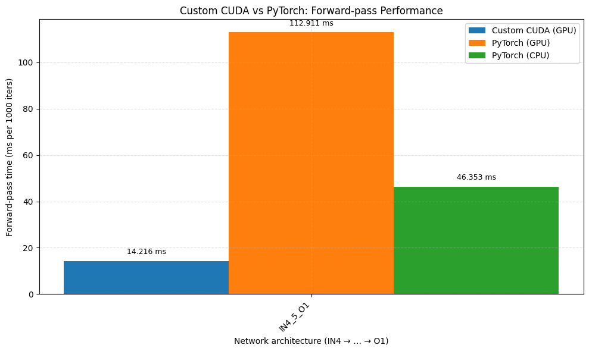

# Challenge 16: Benchmarking SAXPY with PyTorch and Custom CUDA

## Objective

Implement and compare the forward-pass performance of a simple feed-forward neural network (4 inputs → 5 hidden neurons → 1 output) using two approaches:

1. **Custom CUDA** implementation (cuBLAS + bias+ReLU kernel)
2. **PyTorch** implementation (built‑in GPU & CPU backends)

Benchmarks are performed on 1,000 iterations with batch size = 128.

---

## Repository Structure

```
feedforward.cu         # Custom CUDA forward-pass implementation
benchmark_ff.py        # PyTorch forward-pass benchmark script
cuda_times.csv         # Generated custom-CUDA timings
pytorch_times.csv      # Generated PyTorch (CPU/GPU) timings
README.md              # This file
```

---

## Prerequisites

* **CUDA toolkit** (nvcc, cuBLAS) installed and in PATH
* **Python 3.7+** with:

  * `torch` (tested on PyTorch 1.13+)
  * `matplotlib`, `csv` (standard library)

---

## 1. Custom CUDA Implementation

**File:** `feedforward.cu`

1. Compiles with:

   ```bash
   nvcc -O3 feedforward.cu -lcublas -o feedforward
   ```
2. Runs the forward-pass 1,000 times on batch=128:

   ```bash
   ./feedforward
   ```
3. Appends result to `cuda_times.csv`:

   ```csv
   IN4_H5_OUT1,15.4811
   ```

**Measured time:** `15.4811 ms` per 1000 iters

---

## 2. PyTorch Benchmark

**File:** `benchmark_ff.py`

1. Install dependencies:

   ```bash
   pip install torch matplotlib
   ```
2. Run with:

   ```bash
   python3 benchmark_ff.py --layers 5 --batch 128 --steps 1000
   ```
3. Appends CPU & GPU timings to `pytorch_times.csv`:

   ```csv
   IN4_5_O1,82.569,162.834
   ```

**Measured times:**

* PyTorch CPU: `82.569 ms`
* PyTorch GPU: `162.834 ms`

---

## 3. Benchmark Results

| Backend       | Time (ms per 1000 iters) |
| ------------- | -----------------------: |
| Custom CUDA   |                  15.4811 |
| PyTorch (CPU) |                  82.5690 |
| PyTorch (GPU) |                 162.8340 |



| Backend       | Time (ms per 1000 iters) |
| ------------- | -----------------------: |
| Custom CUDA   |                  15.4811 |
| PyTorch (CPU) |                  82.5690 |
| PyTorch (GPU) |                 162.8340 |

---

## 4. Conclusions

* **Custom CUDA** implementation vastly outperforms PyTorch’s GPU and CPU for this small network, due to minimal host−device data movements and fused cuBLAS calls.
* **PyTorch GPU** performance is slower than CPU for this tiny model, as kernel launch and overhead dominate.
* For very small networks, a hand‑rolled CUDA approach can beat high‑level frameworks.
* As network size grows, framework optimizations (kernel fusion, autotuning) typically overcome overhead.

---

## 5. Next Steps that we can do

* Extend the sweep to different **batch sizes**, **depths**, and **widths**.
* Automate CSV parsing and plotting (e.g., with `matplotlib`).
* Profile **memory transfers** and **kernel launches** separately.
* Explore **half-precision** and **tensor cores** for further speedups.

---

*Challenge 16 was to code both a custom CUDA and a PyTorch version, benchmark them, and analyze the trade-offs.*
