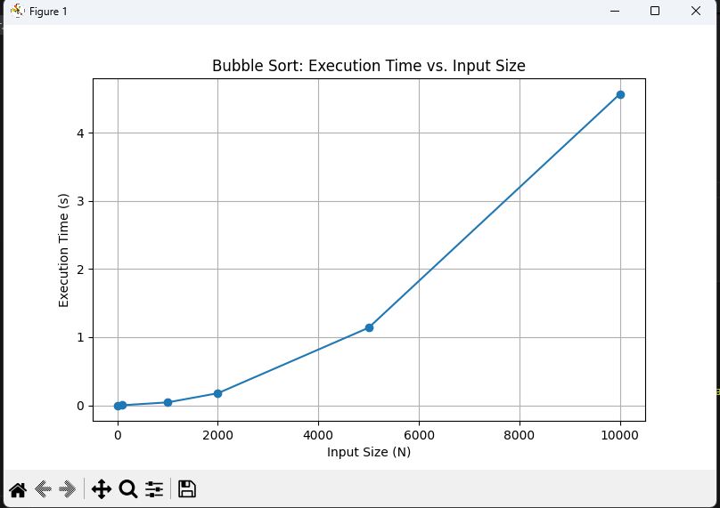

# Challenge #17: Sorting on a Systolic Array

## 🎯 Objective

The aim of this challenge is to:

- Implement **Bubble Sort** on a **systolic array** architecture.
- Write a software version and evaluate its performance.
- Visualize execution times for various input sizes to understand performance trends.

---

## 🧩 Tasks

### 1️⃣ Design a Systolic Array for Bubble Sort

We designed a **1×N linear systolic array**, where each Processing Element (PE) holds a data value and performs a **compare-and-swap** operation with its neighbor. The operation alternates between:

- **Odd phases**: Compare PE₁ with PE₂, PE₃ with PE₄, etc.
- **Even phases**: Compare PE₀ with PE₁, PE₂ with PE₃, etc.

After `N-1` such phases, the array produces sorted data, with each phase taking one clock cycle. Hence, total execution time is roughly **O(N)** in hardware.

---

### 2️⃣ Software Implementation

A standard Bubble Sort algorithm was implemented in Python. We tested it on arrays of increasing size and measured the time taken to sort.

### 🔢 Input Sizes Tested

```text
10, 100, 1000, 2000, 5000, 10000
````

### 🕒 Execution Times

| Input Size | Time (seconds) |
| ---------- | -------------- |
| 10         | 0.000009       |
| 100        | 0.000386       |
| 1000       | 0.051187       |
| 2000       | 0.198570       |
| 5000       | 1.218462       |
| 10000      | 5.129063       |

### 📈 Visualization

Execution time increases **quadratically** with input size, confirming the **O(N²)** time complexity of software Bubble Sort. The graph below shows this trend:



---

## ✅ Conclusion

* **Software Bubble Sort** scales poorly (O(N²)), as shown in the timing results.
* **Systolic array architecture** exploits parallelism via simultaneous compare-and-swap operations, reducing effective complexity to **O(N)** in hardware.
* For large-scale data sorting, systolic arrays are significantly more efficient than conventional CPU-based approaches.

---

## 📂 Files Included

* `BubbleSort_SysArr.py` – Python script for bubble sort and timing.
* `Graph.png` – Execution time vs. input size plot.
* `README.md` – Summary of the challenge, implementation, and analysis.

---

## 📌 Notes

* The goal was not to optimize Bubble Sort itself but to **demonstrate the benefit of hardware parallelism** using a basic sorting algorithm.


