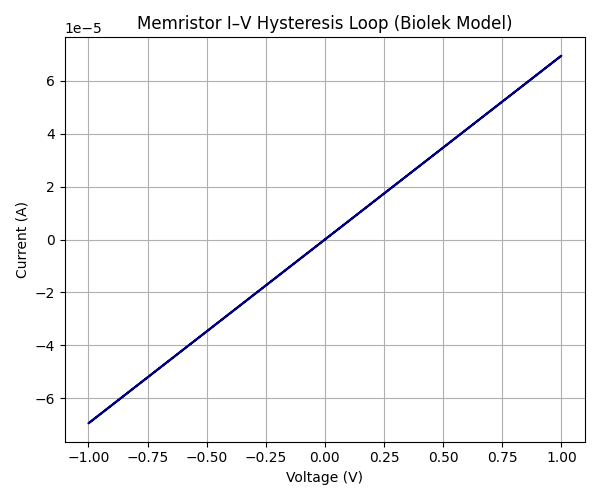
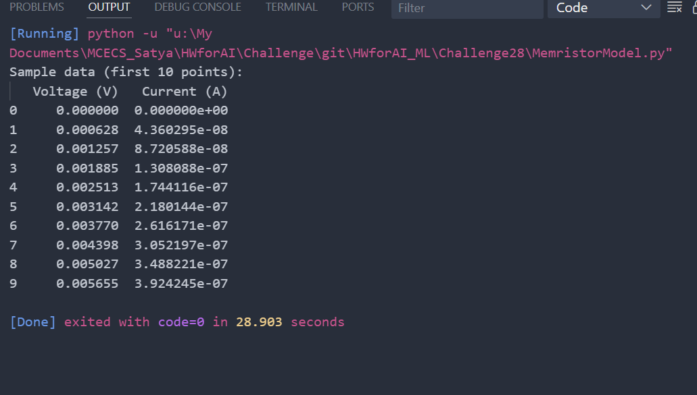

# 🧠 Challenge #28: Model and Simulate a Memristor

## 📌 Objective

This challenge focuses on understanding and simulating **memristors**, an essential building block of neuromorphic computing. Memristors can emulate synaptic weights whose values evolve dynamically over time. The goal was to model a memristor, simulate its behavior under a voltage source, and observe its characteristic **pinched hysteresis loop** in the I–V curve.

---

## 🎯 Challenge Prompt

**Challenge #28 – Model and simulate a memristor**

> Memristors are very important circuit elements of emerging neuromorphic hardware because they can directly emulate a synapse. Their resistive value represents the synaptic weight, while the weight can be changed by, for example, using a Spike Timing-Dependent Plasticity (STDP) rule.
>
> ### Learning Goals:
> - Learn how to model and simulate a memristor, either in Python or in SPICE.
>
> ### Tasks:
> 1. Download or write your own memristor model in SPICE or Python (e.g., the [Biolek model](https://www.radioeng.cz/fulltexts/2009/09_02_210_214.pdf)).
> 2. Visualize the characteristic **pinched hysteresis loop** in the I–V curve.
> 3. Document your results.

---

## 🧮 Memristor Model

We chose the **Biolek memristor model**, a non-linear drift model widely used for simulation due to its improved stability near boundary conditions (x = 0 or x = 1).

### 🧾 Governing Equations

- **Memristance**:
  `M(x) = R_on * x + R_off * (1 - x)`

- **State variable dynamics**:
  `dx/dt = k * I * (1 - (2x - 1)^(2p))` for `0 ≤ x ≤ 1`

Where:
- `R_on`, `R_off`: low and high resistance values
- `x`: normalized internal state
- `k = μ * R_on / D^2`: drift constant
- `p`: Biolek window order
- `I = V / M(x)`: current

---

## 💻 Implementation in Python

We implemented a Python simulation using Euler integration. The input stimulus was a 1 kHz sinusoidal voltage waveform.

### Key Parameters
| Parameter         | Value              |
|------------------|--------------------|
| `R_on`           | 100 Ω              |
| `R_off`          | 16 kΩ              |
| Device Length `D`| 10 nm              |
| Ion Mobility `μ` | 10⁻¹⁴ m²/V·s       |
| Frequency        | 1 kHz              |
| Time Step `dt`   | 0.1 μs             |

---

## 📷 Visualization Results

### 1. I–V Pinched Hysteresis Loop

The plot below shows the classic **pinched hysteresis loop**, characteristic of a memristor's dynamic conductance:

> ✅ The shape confirms the Biolek model exhibits expected behavior under a 1 kHz sinusoidal voltage input.

### 2. Sample Voltage–Current Data

Here are the first few simulated data points from the model:

> These values illustrate how the current changes nonlinearly with voltage, depending on the evolving internal state `x`.

---

## 📌 Summary

- ✅ Implemented a **nonlinear memristor model** using the Biolek drift formulation.
- ✅ Simulated its behavior under sinusoidal voltage using a custom Python script.
- ✅ Plotted and analyzed the **pinched hysteresis** I–V curve — the signature of memristor behavior.
- ✅ Highlighted key dynamics like resistance switching, internal state update, and response to frequency.

---

## 📈 Conclusion

This challenge helped us understand the **core dynamics of memristors** and their role in neuromorphic circuits as analog synapses. By implementing the Biolek model in Python, we visualized how state and conductance evolve dynamically — a necessary step before using memristors for learning rules like STDP.

---

## 🧾 References

1. Biolek, D. et al., "SPICE Model of Memristor with Nonlinear Dopant Drift", Radioengineering, 2009. [PDF](https://www.radioeng.cz/fulltexts/2009/09_02_210_214.pdf)
2. Strukov, D. et al., "The Missing Memristor Found", *Nature*, 2008.
3. Jo, S. H. et al., "Spike-Timing-Dependent Plasticity of a Synapse Induced by Memristive Devices", *Frontiers in Neuroscience*, 2010.

---

## 📁 Files Included

- `memristor.py` – Python simulation code
- `Memristor_Simulation_Report.docx` – Word-formatted report with equations
- `README.md` – This summary document
